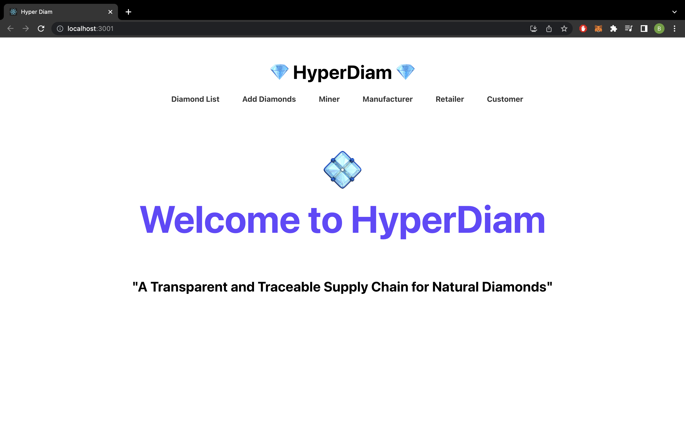
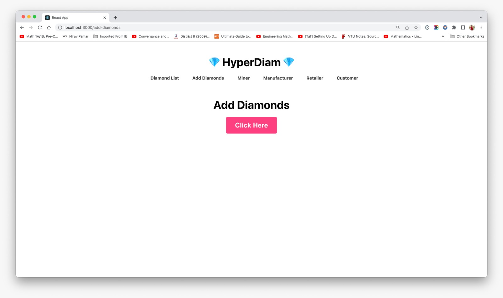
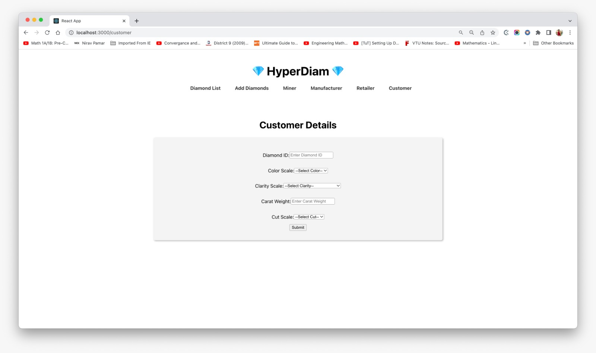
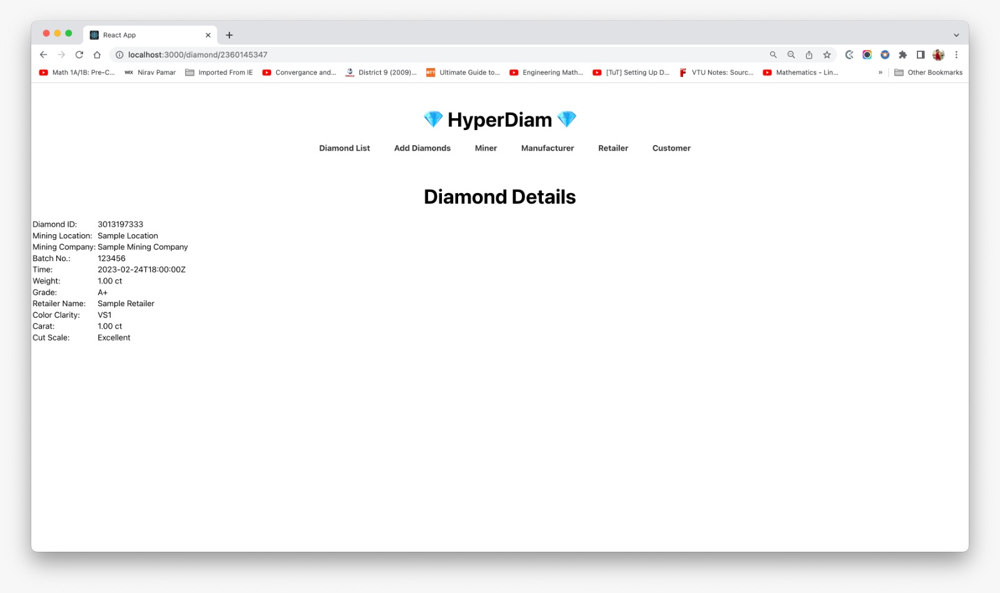
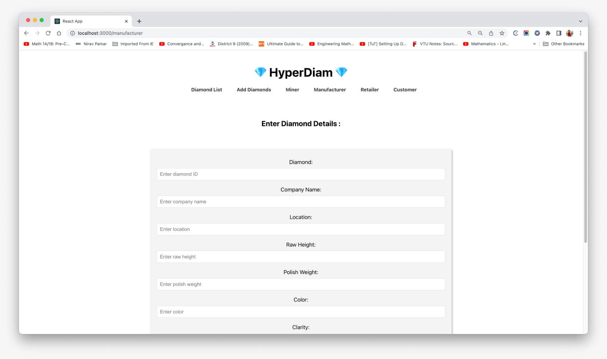
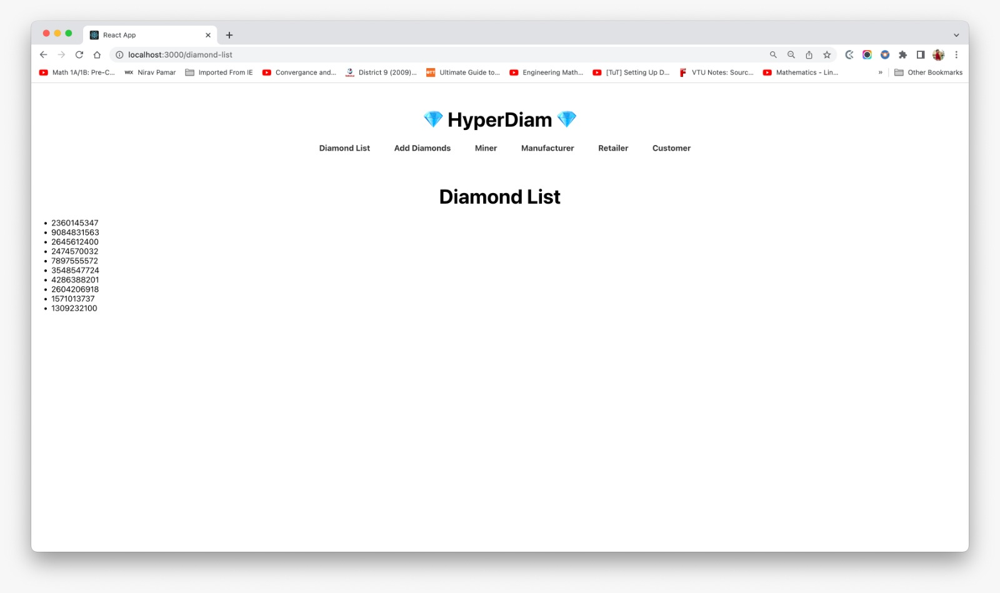
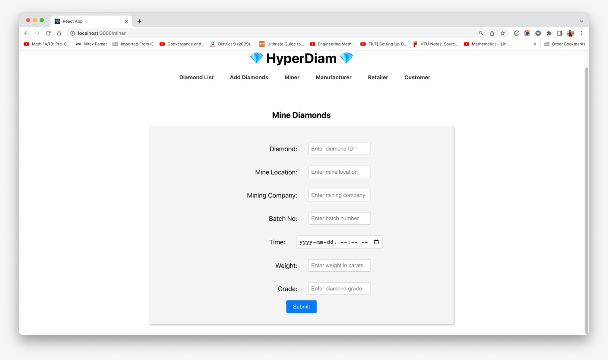
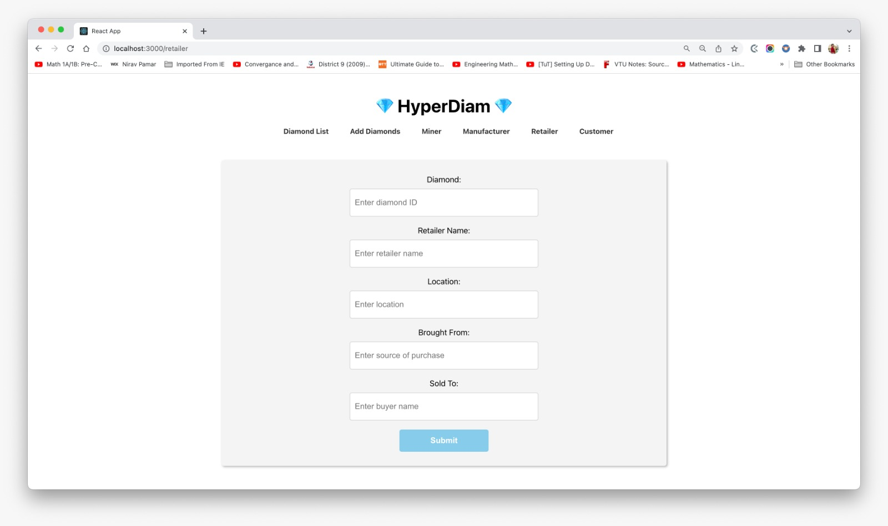

# Project Description:
The Diamond Supply Chain project is a blockchain-based solution that aims to provide transparency and traceability for the diamond supply chain from the point of mining to the point of sale. The project leverages the Hyperledger Fabric framework and utilizes smart contracts to ensure that the information stored on the blockchain is secure and tamper-proof.
The main goal of this project is to address the problem of unethical practices within the diamond industry, such as the use of conflict diamonds, which has resulted in human rights abuses and funding of wars in several African countries. The project aims to provide a solution that will allow consumers to know the origin of the diamonds they purchase and to ensure that they are ethically sourced.
The Diamond Supply Chain project enables participants in the diamond supply chain, such as miners, diamond cutters, wholesalers, and retailers, to register their transactions on the blockchain. This process creates a transparent and immutable record of the diamond's journey from the mine to the end consumer. The smart contracts are programmed to automatically execute certain actions, such as verifying the authenticity of the diamond, and ensuring that it has been ethically sourced. Aside from that there is also a problem of Chemical Vapour Disposition based diamonds being mixed with natural diamonds, which is preventing customers to trust the authenticity of the diamond before purchasing promoting second guesses resulting in decrease in sell.
The Diamond Supply Chain project will benefit all stakeholders in the diamond industry by providing transparency, traceability, and accountability. Consumers can be assured that the diamonds they purchase are ethically sourced and have a verified origin, and the diamond industry can build trust with its customers by providing a transparent and secure supply chain.
Overall, the Diamond Supply Chain project aims to revolutionize the diamond industry by providing a blockchain-based solution that promotes transparency, accountability, and ethical practices and fraud.

# Requirements:
•	The platform should allow users to view the current status of diamonds, including their ownership history and certification information.
•	The platform should provide a way for users to register new diamonds and add them to the supply chain.
•	The platform should ensure that only authorized users can access and modify the data on the blockchain.
•	The platform should be able to handle a large number of transactions per second to ensure scalability.
•	The platform should be able to integrate with existing diamond certification authorities to ensure the accuracy and validity of diamond certification information.
•	The platform should be able to provide real-time updates on the location of diamonds as they move through the supply chain.
•	The platform should be able to provide analytics and reports on the supply chain to help stakeholders make informed decisions.

 

# Roles and Policies
Roles and policies play a critical role in managing access and control in the diamond supply chain network. The following are some possible roles and policies for the network:

• Diamond Miner: A diamond miner has access to add new diamonds to the network. They can create a new diamond asset with information such as weight, clarity, and color. The miner can only modify the diamond asset if it has not been transferred or sold.
• Diamond Cutter: A diamond cutter can modify the diamond asset to update its shape and cut. They cannot modify any other information such as weight, clarity, or color.
• Diamond Polisher: A diamond polisher can modify the diamond asset to update its finish and quality. They cannot modify any other information such as weight, clarity, or color.
• Diamond Certifier: A diamond certifier has access to the diamond asset after it has been cut and polished. They can verify the diamond's authenticity, quality, and other important information. If the diamond is certified, the certifier can add a certificate of authenticity to the asset.
• Diamond Shipper: A diamond shipper can transfer the diamond asset to a new owner. They must verify the authenticity and quality of the diamond before transferring it. The shipper can only transfer the asset if the diamond is certified and has all the necessary documentation.
• Diamond Seller: A diamond seller can sell the diamond asset to a new owner. They must verify the authenticity and quality of the diamond before selling it. The seller can only sell the asset if the diamond is certified and has all the necessary documentation.

The policies for the diamond supply chain network are as follows:
• Access Control Policy: Only authorized personnel should have access to the network. Each role should have defined access permissions and restrictions.
• Asset Modification Policy: The diamond asset can only be modified by authorized personnel in specific states of the supply chain.
• Asset Transfer Policy: The diamond asset can only be transferred if it has been certified and has all the necessary documentation.
• Certification Policy: Only certified diamonds can be sold and transferred. A diamond must go through the certification process before it can be sold or transferred.

# Benefits: 
• Increased Transparency: The DiamondSupplyChain system enables all parties involved in the supply chain, including miners, cutters, polishers, certifiers, and shippers, to have access to real-time data about the diamonds being processed. This increased transparency can help reduce the risk of fraud, ensure compliance with regulations, and build trust among all parties.

• Enhanced Efficiency: By using a blockchain-based system like DiamondSupplyChain, the supply chain process can be streamlined, reducing the need for manual processes, paperwork, and intermediaries. This can result in faster processing times, reduced costs, and greater efficiency in the overall supply chain.

• Improved Traceability: The DiamondSupplyChain system allows for the tracking of diamonds throughout the supply chain, from mining to sale. This improves traceability and accountability, making it easier to identify the source of a diamond and ensuring that it is ethically sourced.

• Better Customer Confidence: With the increased transparency and traceability provided by DiamondSupplyChain, customers can have greater confidence in the diamonds they purchase. They can be assured that the diamonds are ethically sourced, have undergone proper certification, and have been tracked throughout the supply chain, reducing the risk of purchasing a conflict diamond.

# Result Screenshots:

